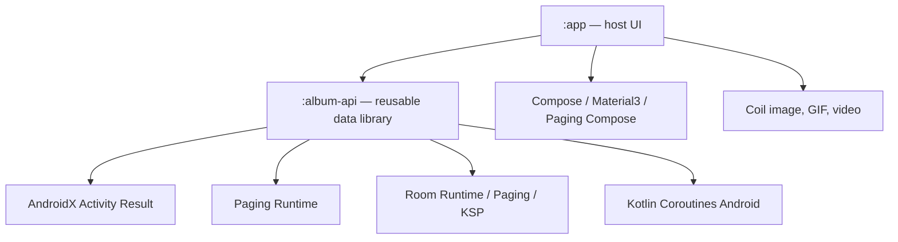

# Dependency Reference

## Module Graph

| Module | Type | Project dependencies | Compose enabled |
|---|---|---|---|
| `:app` | Android application | `:album-api` | yes |
| `:album-api` | Android library | none | no |

## Important Aliases

| Scope | Aliases |
|---|---|
| Library public API | `androidx-activity-ktx`, `androidx-paging-runtime` |
| Library implementation | `androidx-core-ktx`, `androidx-lifecycle-runtime-ktx`, `androidx-room-runtime`, `androidx-room-paging`, `kotlinx-coroutines-android` |
| Library code generation/tests | `androidx-room-compiler`, Paging/Room test helpers, coroutine test, Robolectric |
| Host UI | Activity Compose, lifecycle/ViewModel Compose, Paging Compose, Compose BOM/UI/Material3 |
| Host media rendering | Coil Compose/GIF/video |

## Rules

- Dependency direction is one-way: `:app` to `:album-api`.
- Add dependencies through `gradle/libs.versions.toml` and use catalog aliases.
- Keep Compose UI, Material3, Coil, permission-prompt libraries, and app-only utilities out of `:album-api`.
- Regenerate `.codex/references/_scan.json` after module, dependency, or source-layout changes.
