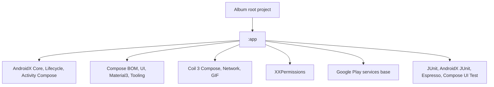

# Dependency Reference

## Module Graph

## Gradle Modules

| Module | Path | Type | Depends on project modules |
|---|---|---|---|
| `:app` | `app` | Android application | none |

## Version Catalog Aliases Used by `:app`

| Alias | Configuration | Purpose |
|---|---|---|
| `libs.androidx.core.ktx` | implementation | Kotlin Android extensions |
| `libs.androidx.lifecycle.runtime.ktx` | implementation | Lifecycle runtime |
| `libs.androidx.activity.compose` | implementation | Compose activity integration |
| `libs.androidx.compose.bom` | implementation, androidTestImplementation | Compose dependency alignment |
| `libs.androidx.compose.ui` | implementation | Compose UI |
| `libs.androidx.compose.ui.graphics` | implementation | Compose graphics |
| `libs.androidx.compose.ui.tooling.preview` | implementation | Compose previews |
| `libs.androidx.compose.material3` | implementation | Material3 components |
| `libs.androidx.compose.viewmodel` | implementation | ViewModel integration for Compose |
| `libs.device.compat` | implementation | Device compatibility utility |
| `libs.xx.permissions` | implementation | Runtime permissions |
| `libs.bundles.coil` | implementation | Coil image loading bundle |
| `libs.play.services.base` | implementation | Google Play services module install support |
| `libs.junit` | testImplementation | Local unit tests |
| `libs.androidx.junit` | androidTestImplementation | Instrumented tests |
| `libs.androidx.espresso.core` | androidTestImplementation | UI instrumentation |
| `libs.androidx.compose.ui.test.junit4` | androidTestImplementation | Compose UI testing |
| `libs.androidx.compose.ui.tooling` | debugImplementation | Compose tooling |
| `libs.androidx.compose.ui.test.manifest` | debugImplementation | Compose test manifest |

## Cycle Check

No project-module cycle exists because the project currently has only `:app`.

## Change Rules

- Add new third-party dependencies through `gradle/libs.versions.toml`.
- Prefer version catalog aliases in `app/build.gradle.kts`.
- If a new module is added, rerun `python .codex/scripts/gen_references.py` and update this file.

