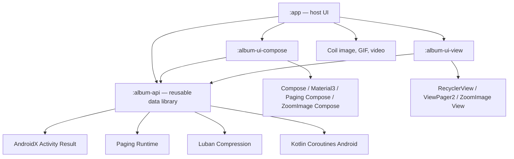

# Dependency Reference

## Module Graph

```mermaid
graph TD
    App[":app — host UI"] --> Api[":album-api — reusable data library"]
    App --> ComposeUI[":album-ui-compose"]
    App --> ViewUI[":album-ui-view"]
    ComposeUI --> Api
    ViewUI --> Api
    ComposeUI --> Compose["Compose / Material3 / Paging Compose / ZoomImage Compose"]
    ViewUI --> ViewDeps["RecyclerView / ViewPager2 / ZoomImage View"]
    App --> Coil["Coil image, GIF, video"]
    Api --> Activity["AndroidX Activity Result"]
    Api --> Paging["Paging Runtime"]
    Api --> Luban["Luban Compression"]
    Api --> Coroutines["Kotlin Coroutines Android"]
```

| Module | Type | Project dependencies | Compose enabled |
|---|---|---|---|
| `:app` | Android application | `:album-api`, `:album-ui-compose`, `:album-ui-view` | yes |
| `:album-ui-compose` | Android library | `:album-api` | yes |
| `:album-ui-view` | Android library | `:album-api` | no |
| `:album-api` | Android library | none | no |

## Important Aliases

| Scope | Aliases |
|---|---|
| Library public API | `androidx-activity-ktx`, `androidx-paging-runtime` |
| Library implementation | `androidx-core-ktx`, `androidx-lifecycle-runtime-ktx`, `kotlinx-coroutines-android`, `luban` |
| Library tests | Paging test helpers, coroutine test, Robolectric |
| UI libraries | `androidx-recyclerview`, `androidx-viewpager2`, `zoomimage-view`, `zoomimage-compose`, `androidx-paging-compose` |
| Host UI | Activity Compose, lifecycle/ViewModel Compose, Paging Compose, Compose BOM/UI/Material3 |
| Host media rendering | Coil Compose/GIF/video |

## Rules

- Dependency direction is one-way: `:app` to UI libraries and `:album-api`; both UI libraries depend on `:album-api`. Coil stays in the demo host.
- Add dependencies through `gradle/libs.versions.toml` and use catalog aliases.
- Keep Compose UI, Material3, Coil, permission-prompt libraries, and app-only utilities out of `:album-api`.
- Regenerate `.codex/references/_scan.json` after module, dependency, or source-layout changes.
